**Voicechat - Ohje**
--
Voicechat on selaimen puhesyntetisaattoria käyttävä chat-ohjelma. Voicechatissa jokaista keskustelijaa edustaa animoitu puhuva-pää, joka puhuu käyttäjän viestit. Voicechat ei tallenna käyttäjien keskusteluhistoriaa.

Rekisteröitymätön käyttäjä
--
Rekisteröitymättömälle käyttäjälle on tarjolla ohjelman perustoiminnallisuudet. 

- Uuden käyttäjän luonti *New user* - näkymästä
- Sisäänkirjautuminen *Login* - näkymästä
- Keskusteluun osallistuminen nimimerkillä, joka asetetaan *Chatrooms* - näkymästä.

Rekisteröitymätön käyttäjä ei voi valita itselleen varattua nimimerkkiä, eli rekisteröityneen käyttäjän käyttäjätunnusta. 

Rekisteröitynyt käyttäjä
--
Rekisteröityneelle käyttäjälle on tarjolla ohjelman laajennetut ominaisuudet. 

- Sisäänkirjautuminen *Login* - näkymästä
- Keskusteluun osallistuminen omalla varatulla käyttäjätunnuksella *Chatrooms* - näkymästä.
- Uusien julkisten huoneiden luonti *Chatrooms* - näkymästä
  - Julkisen huoneen poistaminen
- Uusien yksityishuoneiden luonti *Chatroom* - näkymästä
  - Muiden käyttäjien kutsuminen luotuihin yksityishuoneeseen
  - Muiden käyttäjien kutsuminen yksityishuoneisiin, joissa käyttäjä on kutsuttuna
  - Itse luodun yksityishuoneen poistaminen
- Käyttäjähallinta klikkaamalla omaa käyttäjänimeä yläpalkista
  - Oman sähköpostiosoitteen muuttaminen
  - Oman salasanan muuttaminen
  - Oman käyttäjätilin poistaminen (Poistaa myös luodut huoneet)
- Mahdollisuus käyttää oletus - puhuvasta päästä poikkeavaa puhuvaa päätä ottamalla ohjelman sisäisellä web-kamera -käyttöliittymällä uudet kuvat oletusten tilalle (*Custom chatface* - näkymä). 

---

**Ohjelman käyttäminen**
--

---

Tervetulonäkymä
--

Tervetulonäkymästä on mahdollista siirtyä Chatrooms-, New User- ja Login - näkymiin. Tervetulonäkymään pääsee klikkaamalla vasemman ylälaidan puhekupla-ikonia.

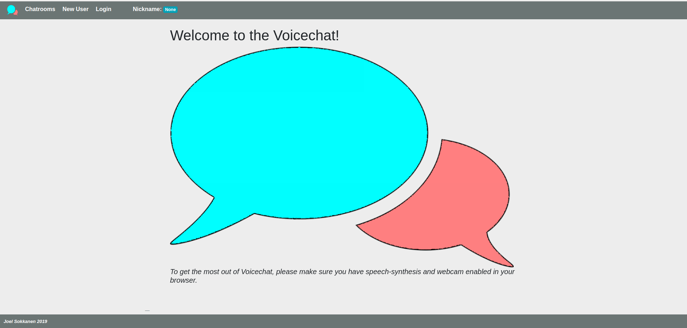

Chatrooms (Rekisteröidyn käyttäjän näkymä)
--

Chatrooms-näkymässä voi luoda uusia chathuoneita *Create A New Room - painikkeella*, Liittyä olemassaoleviin huoneiseen klikkaamalla niiden nimiä, hallinnoida privaattihuoneiden käyttäjiä ja poistaa omia huoneita.   
(Kuvassa kirjautuneena käyttäjä "FooBar")

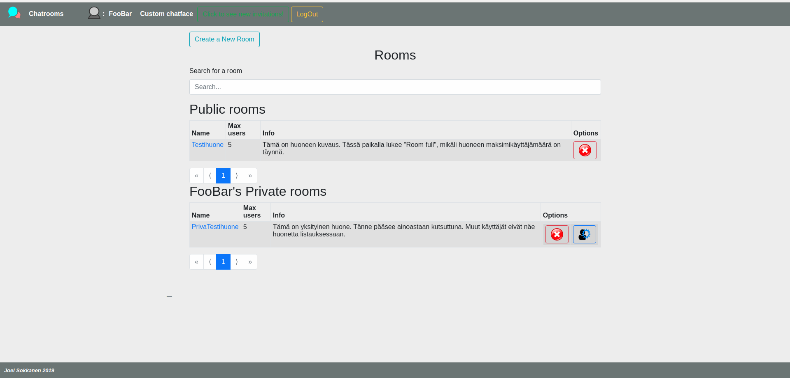

Click to see new invitations - painikkeesta näkee käyttäjälle tulleet yksityishuonekutsut. Kutsun voi joko hyväksyä painamalla *Accept*, hylätä painamalla *Decline* tai jättää odottamaan painamalla näkymän alareunan *OK* - painiketta.

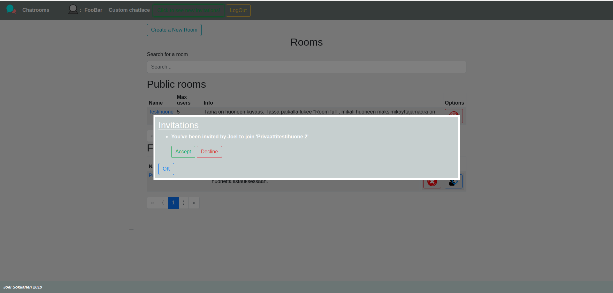

Kutsun hyväksymisen jälkeen uusi yksityishuone näytetään käyttäjän yksityishuonelistauksessa.

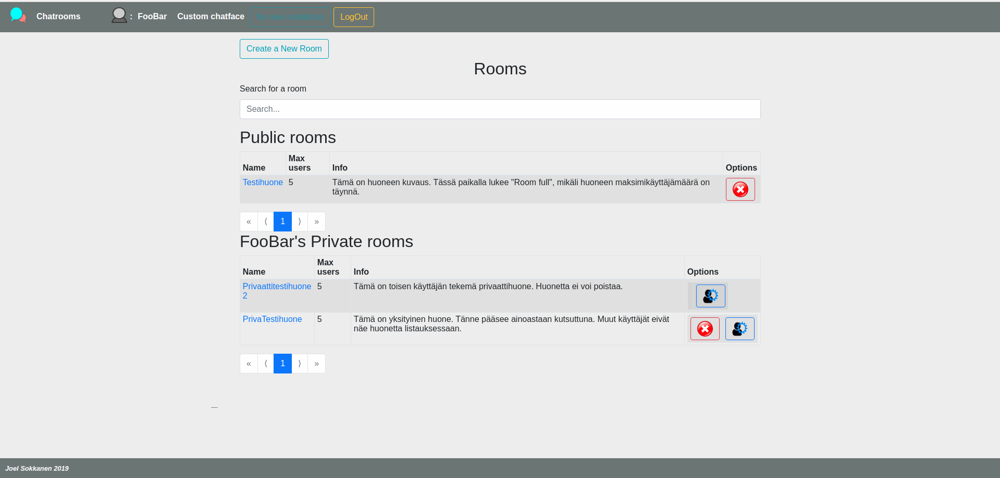

Privaattihuoneen hallinnointi tapahtuu huoneen rivillä olevasta ratas-symbolista. Huoneen omistajan nimimerkki näytetään käyttäjälistauksessa korostettuna. Huoneeseen voi kutsua lisää käyttäjiä syöttämällä halutun käyttäjän nimimerkin tai sähköpostiosoitteen kutsukenttään. Kutsu lähetetään painamalla *Invite* -painiketta.

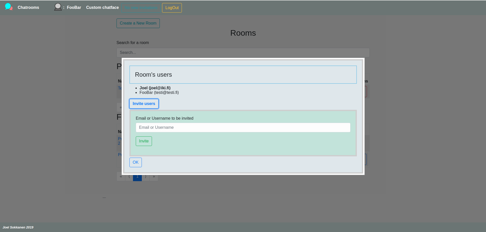

Uuden huoneen luominen tapahtuu *Create a New Room* - painikkeesta. Huoneelle on pakollista antaa 5-128 merkkiä pitkä nimi. Huoneelle voi antaa maksimissaan 256 merkkiä pitkän kuvauksen. Lisäksi huoneelle määritellään, onko huone yleinen vai yksityinen ja mikä on huoneen enimmäiskäyttäjämäärä (2, 5, 10 vai 999).

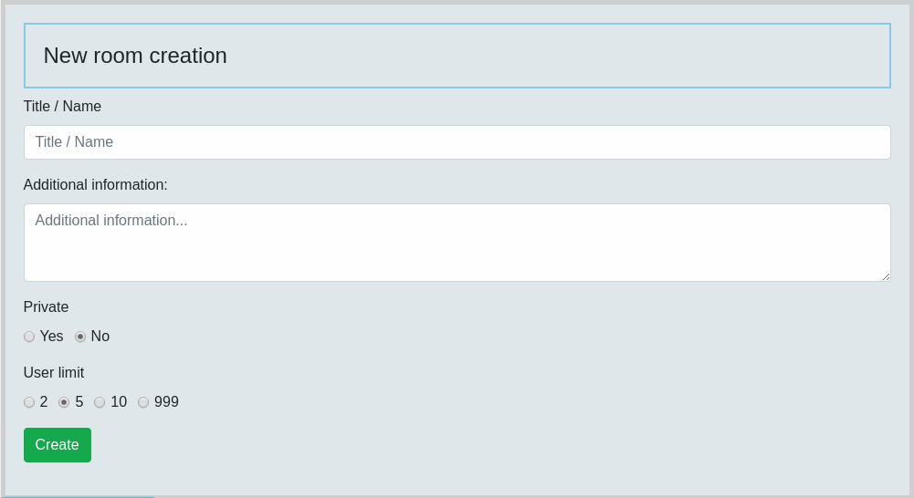

---

Chathuone
--

Klikkaamalla huoneen nimeä chatrooms -näkymästä pääsee huoneeseen keskustelemaan. Huoneessa on rullaava tekstichatti sekä jokaista käyttäjää vastaavat puhuvat päät.

Huone näyttää valitun kielen. Puhuvan pään *idle* - teksti päivittyy *typing* -tekstiksi, kun käyttäjä kirjoittaa aktiivisesti.

Huoneen toiminnallisuudet:
- Voice select: Voit valita puhesyntetisaattorin käyttämän kielen selaimeen ladattujen kielten joukosta
- Speak usernames: Puhesyntetisaattori puhuu myös käyttäjänimet, jolloin chattia pystyy seuraamaan ilman monitorin seuraamista.
- Select Bubble Color: Oman puhekuplan värinvalinta. Valinta välittyy myös muille käyttäjille
- Hide/Show textchat: Tekstichatin piilotus/näyttäminen
- Toggle small/large textchat: Tekstichatin koon valinta
- Mute-painikkeet (jokaisessa puhuvassa päässä): Vaimenna valitun käyttäjän puhe
- Emojis: Hymiöiden valinta
- Send: Lähetä viesti

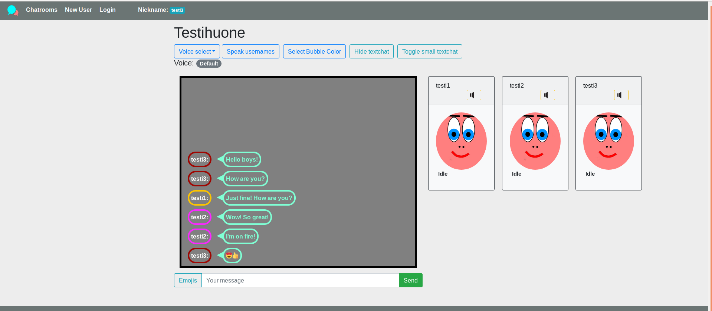

---

Login
--

Kirjautumisnäkymässä voi kirjautua aiemmin luodulla käyttäjätunnuksella. Lomake antaa visuaalisen palautteen, mikäli kirjautumista yritetään väärällä käyttäjätunnus / salasana - yhdistelmällä.

Ohjelma muistaa sisäänkirjautuneen käyttäjän myös sivun uudelleenlatauksen jälkeen.

Ohjelmasta voidaan kirjautua ulos *LogOut* - painikkeesta.

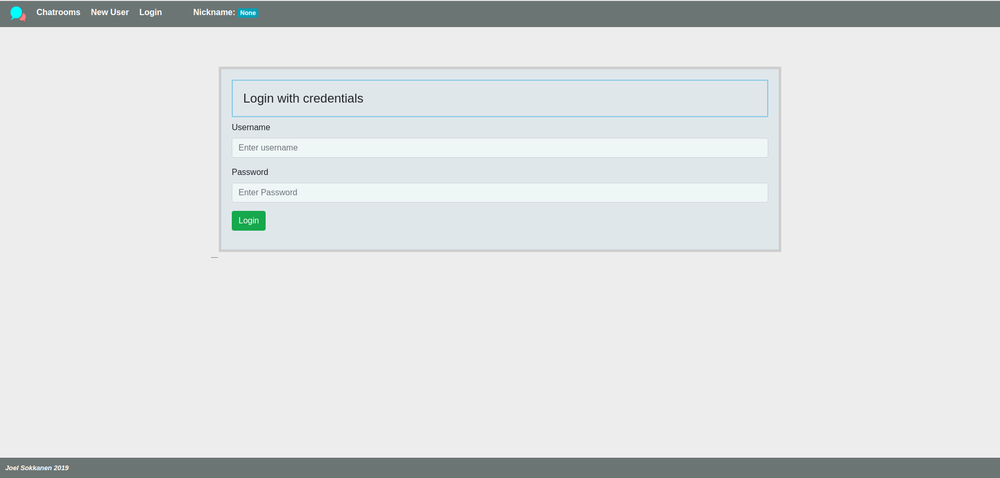

New user
--

Uuden käyttäjän näkymästä voi luoda ohjelmaan uuden käyttäjän.

Vaatimukset:
- Käyttäjänimen on oltava uniikki ja 3-15 merkkiä pitkä
- Salasanan vähimmäispituus on 5 merkkiä
- Sähköpostiosoitteen on oltava oikeaa muotoa (xxx@yyy.(zzz.)aa)

Uusi käyttäjä luodaan *Register* - painikkeesta.

Lomake antaa visuaalisen palautteen virheellisistä kentistä.

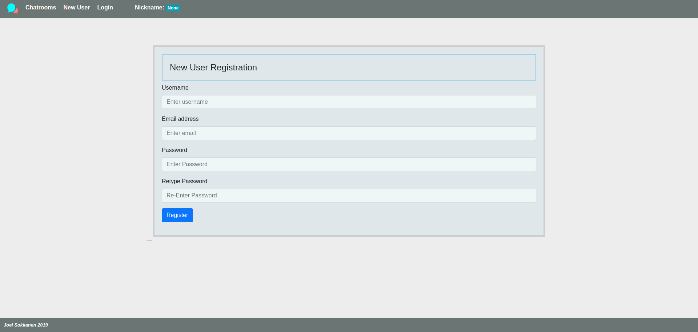

User management (Rekisteröityneen käyttäjän näkymä)
--

Käyttäjähallintaan pääsee klikkaamalla omaa nimimerkkiä ohjelman yläpalkista. 

Käyttäjähallinnassa on mahdollista muuttaa omaa sähköpostiosoitetta ja salasanaa. Tietojen muuttamiseksi tulee käyttäjän antaa nykyinen salasanansa.

Näkymästä voi myös poistaa oman käyttäjätilinsä. Tilin poistamisen yhteydessä käyttäjän luomat yleiset ja yksityiset huoneet poistetaan. Huoneissa mahdollisesti ovat muut käyttäjät voivat tällöin jatkaa keskustelua normaalisti, mutta huoneisiin ei pääse enää uusia käyttäjiä. Huone häviää kun viimeinen käyttäjä poistuu huoneesta.

Mikäli käyttäjätilin poistamista yritetään väärällä salasanalla, kirjataan käyttäjä varotoimena ulos VoiceChatista.

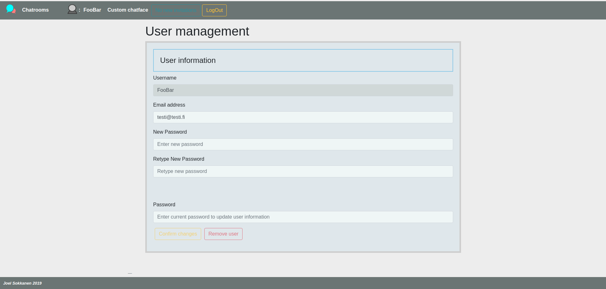

Custom chatface (Rekisteröityneen käyttäjän näkymä)
--

Näkymässä on mahdollista luoda oma puhuva pää chattiin oletuspään tilalle. 

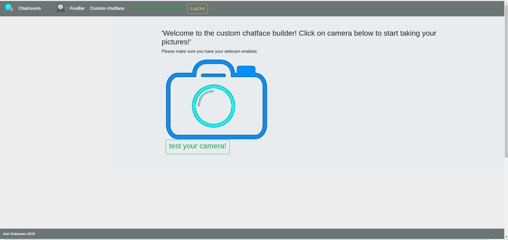

Test your camera! -painikkeesta voi testata, että oma webkamera on otettu selaimessa käyttöön ja kamera toimii normaalisti. Jos kamera toimii normaalisti, tulee käyttäjälle näkyviin alla näkyvä viesti. 

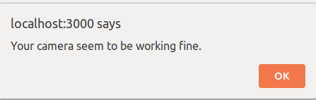

Klikkaamalla kameran kuvaa, siirtyy näkymä kuvausmoodiin. Ohjelma opastaa käyttäjää sanomaan kirjaimia, minkä aikana käyttäjän kasvoista otetaan kuva.

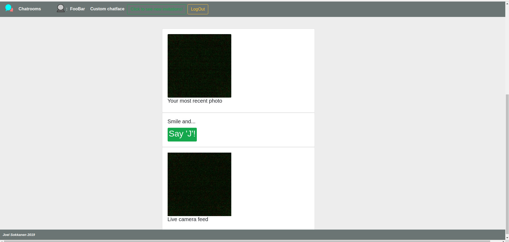

Kuvien ottamisen jälkeen käyttäjä voi varmistaa, että on tyytyväinen kuviinsa.

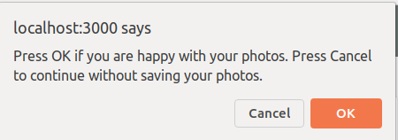

Kuvien tallentumisesta tietokantaan annetaan käyttäjälle ilmoitus.

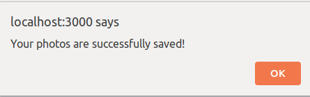

Tuleviin versioihin jääneet parannukset
--
- Sähköpostin hyödyntäminen ilmoituksiin
- Kaikkien otettujen kuvien esittäminen
- Oletus -puhuvan pään vaihtaminen takaisin